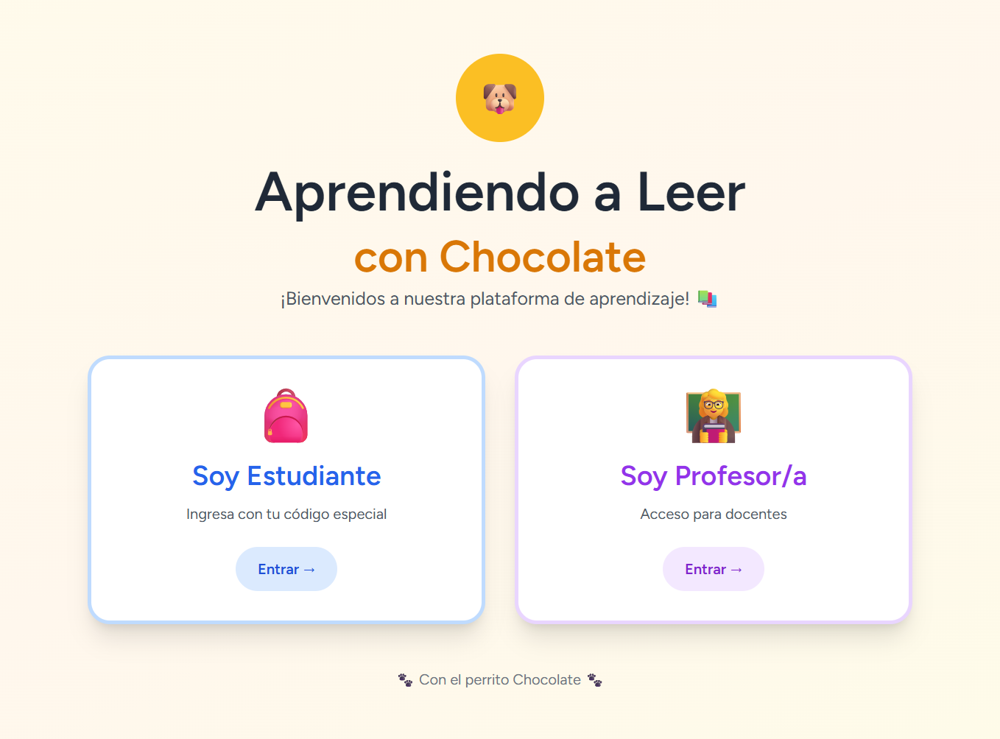
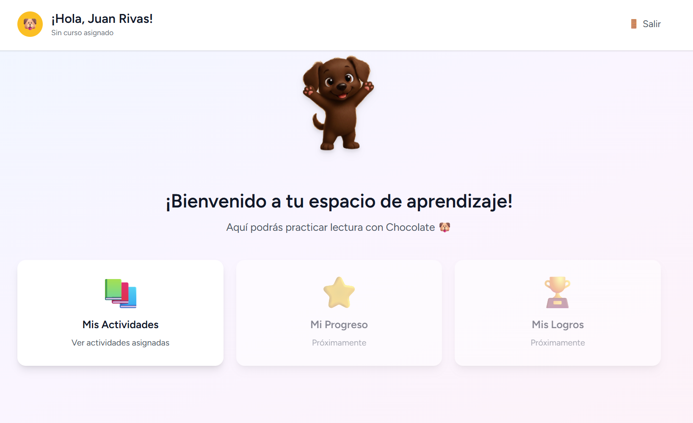
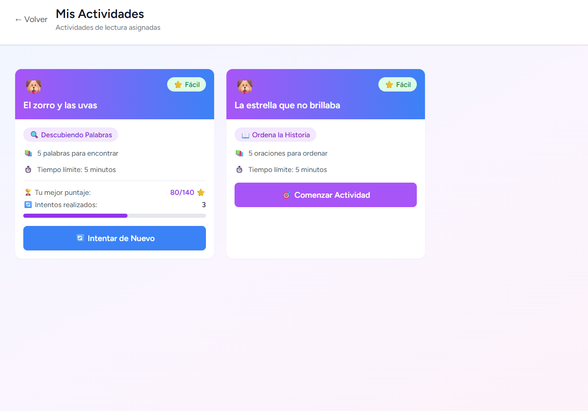
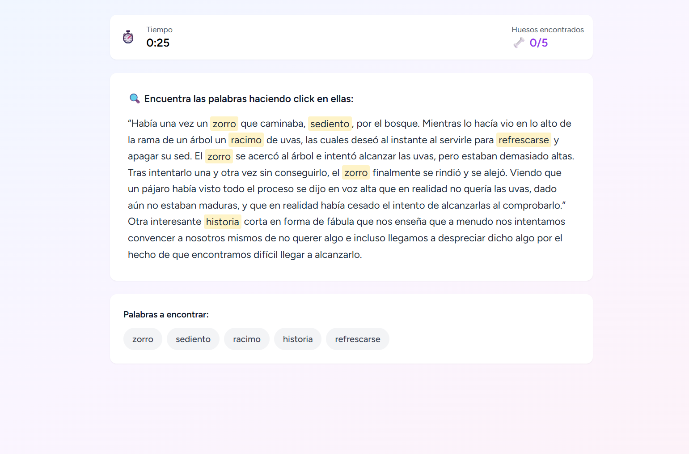
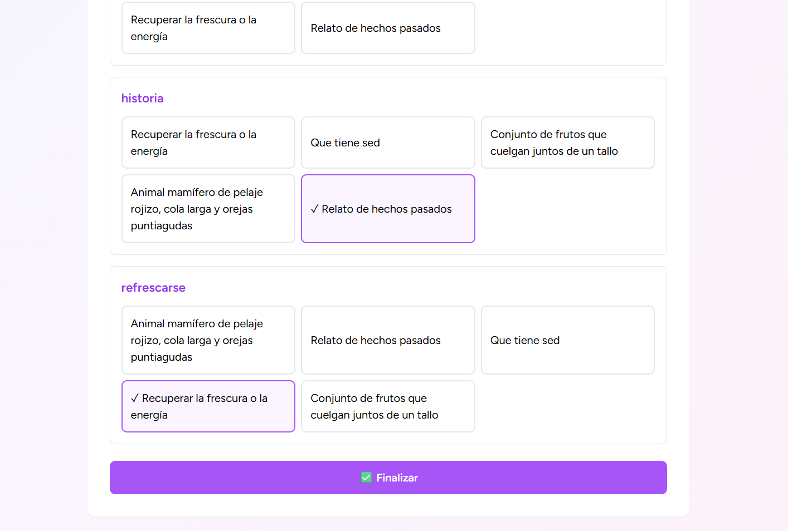
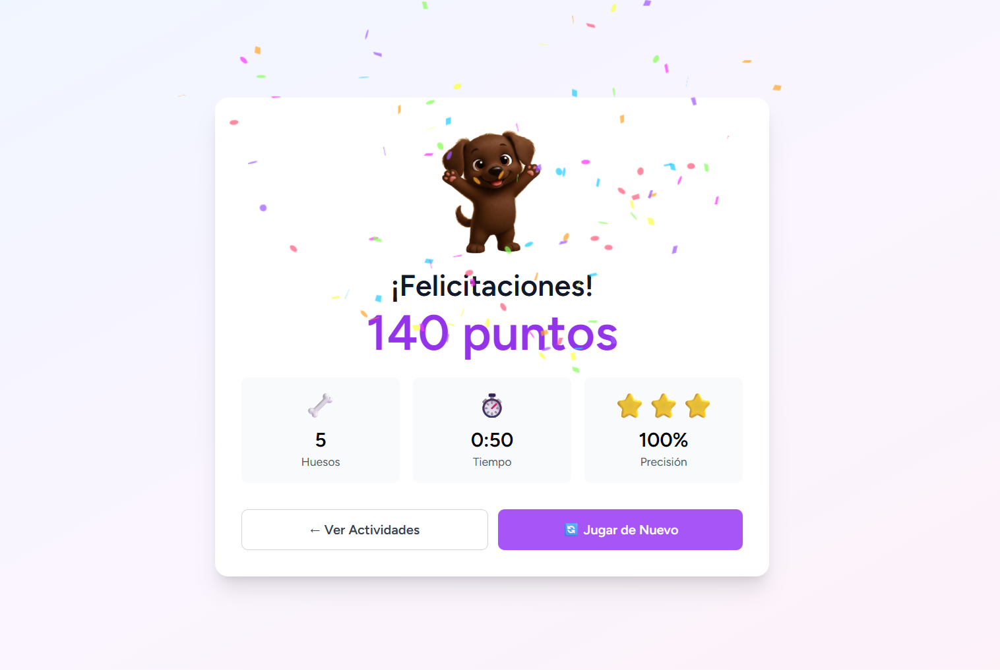

#  Aprendiendo a Leer con Chocolate

##  Descripción

Plataforma web educativa para mejorar habilidades de lectura en estudiantes de 3° y 4° básico (8-10 años) de escuelas públicas chilenas en contextos de vulnerabilidad.

El sistema permite a profesores crear actividades interactivas personalizadas y hacer seguimiento del progreso de sus estudiantes, mientras los niños practican lectura de forma autónoma y entretenida acompañados por "Chocolate", un perro guía virtual.

---

##  Características Principales

-  **2 tipos de actividades interactivas:**
  - "Descubrir las Palabras": Relacionar palabras con definiciones
  - "Ordenar la Historia": Secuenciar oraciones lógicamente
  
-  **Sistema multi-rol:**
  - Administradores: Gestión de cursos y usuarios
  - Profesores: Creación de actividades y seguimiento
  - Estudiantes: Acceso simplificado con código de 6 caracteres

-  **Dashboard de seguimiento:**
  - 8 tipos de gráficos analíticos
  - Reportes PDF descargables
  - Seguimiento individual por estudiante

-  **Sistema de rotación inteligente:**
  - Las actividades no se repiten hasta completar todas
  - Alternancia automática entre tipos de actividad

-  **Diseño responsive:**
  - Compatible con smartphones
  - Compatible con tablets (10")
  - Compatible con PC escritorio
  - Optimizado para conexiones 3G

---

##  Objetivos del Proyecto

### Objetivo General
Mejorar las habilidades lectoras de niños de 8 a 10 años en escuelas públicas de contextos vulnerables mediante actividades interactivas.

### Objetivos Específicos
1. Diseñar actividades pedagógicas
2. Crear interfaz intuitiva centrada en el niño
3. Garantizar compatibilidad multiplataforma
4. Desarrollar sistema de seguimiento de progreso

---

##  Tecnologías Utilizadas

### Frontend
- **React 18** - Biblioteca JavaScript
- **Inertia.js** - Puente Laravel-React
- **Tailwind CSS** - Framework de estilos
- **Recharts** - Visualización de datos

### Backend
- **Laravel 12** - Framework PHP
- **MySQL** - Base de datos relacional
- **PHPUnit** - Testing automatizado

### DevOps
- **Docker** - Contenedorización
- **Git/GitHub** - Control de versiones
- **Laravel Sail** - Entorno de desarrollo

---

##  Requisitos Previos

- Ubuntu 24.04 LTS
- Docker instalado
- Git instalado
- Mínimo 4GB RAM disponible
- Puerto 80 disponible

---

##  Instalación

### Paso 1: Instalar Git

Verificar si Git está instalado:
```bash
git --version
```

Si no está instalado:
```bash
sudo apt update
sudo apt install git -y
```

---

### Paso 2: Instalar Docker

Verificar si Docker está instalado:
```bash
docker --version
```

Si no está instalado, ejecutar:
```bash
# Actualizar paquetes
sudo apt update

# Instalar dependencias
sudo apt install apt-transport-https ca-certificates curl software-properties-common -y

# Agregar clave GPG de Docker
curl -fsSL https://download.docker.com/linux/ubuntu/gpg | sudo gpg --dearmor -o /usr/share/keyrings/docker-archive-keyring.gpg

# Agregar repositorio de Docker
echo "deb [arch=$(dpkg --print-architecture) signed-by=/usr/share/keyrings/docker-archive-keyring.gpg] https://download.docker.com/linux/ubuntu $(lsb_release -cs) stable" | sudo tee /etc/apt/sources.list.d/docker.list > /dev/null

# Instalar Docker
sudo apt update
sudo apt install docker-ce docker-ce-cli containerd.io docker-buildx-plugin docker-compose-plugin -y

# Agregar usuario al grupo docker (para no usar sudo)
sudo usermod -aG docker ${USER}

# Aplicar cambios de grupo (cerrar y abrir sesión, o ejecutar)
newgrp docker

# Verificar instalación
docker --version
docker compose version
```
---

### Paso 3: Clonar el Repositorio
```bash

# Crear directorio
mkdir proyectos/

# Entrar al directorio
cd proyectos/

# Clonar desde GitHub
git clone https://github.com/PatCard/react.git

# Entrar al directorio
cd react/
```

---

### Paso 4: Configurar Variables de Entorno
```bash
# Copiar archivo de ejemplo
cp .env_ex .env
```

**Configuración importante:** Editar el archivo `.env` y ajustar:
```bash
nano .env
```

Modificar estas líneas con la IP de máquina HOST:
```env
SESSION_DOMAIN=192.168.X.XX
```

**Para obtener la IP local:**
```bash
hostname -I | awk '{print $1}'
```

También editar `vite.config.js`:
```bash
nano vite.config.js
```

Ajustar la configuración del servidor:
```javascript

cors: {
    origin: ['http://192.168.X.XX', 'http://192.168.X.XX:80'],
    credentials: true
},
hmr: {
    host: '192.168.X.XX',
},
watch: {
    usePolling: true,
},

```

---

### Paso 5: Levantar Contenedores
```bash
# Levantar contenedores en segundo plano
docker compose up -d
```
---

### Paso 6: Instalar Dependencias Backend
```bash
# Instalar dependencias de Composer
docker compose run --rm app composer install

# Ver estado de contenedores
docker compose ps
```

**Salida esperada:**
```
NAME         IMAGE       STATUS         PORTS
react-app    react-app   Up X seconds   0.0.0.0:80->80/tcp, 0.0.0.0:5173->5173/tcp
mysql        mysql:8.0   Up X seconds   0.0.0.0:3306->3306/tcp
```

---

### Paso 7: Importar Base de Datos

#### Copiar archivo SQL al contenedor MySQL
```bash
docker cp backup_desarrollo.sql $(docker compose ps -q mysql):/tmp/backup.sql
```

#### Importar la base de datos
```bash
docker compose exec mysql sh -c 'mysql -u sail -ppassword laravel < /tmp/backup.sql'
```

#### Verificar que se importó correctamente
```bash
# Ver tablas importadas
docker compose exec mysql mysql -u sail -ppassword laravel -e "SHOW TABLES;"

# Ver usuarios importados
docker compose exec mysql mysql -u sail -ppassword laravel -e "SELECT id, name, email, role FROM users LIMIT 5;"
```

---

### Paso 8: Limpiar Caché de Laravel
```bash
# Limpiar todas las cachés
docker compose exec app php artisan config:clear
docker compose exec app php artisan cache:clear
docker compose exec app php artisan route:clear
docker compose exec app php artisan view:clear
```

---

### Paso 9: Verificar Instalación

#### Acceder a la aplicación
Abrir navegador en: **http://192.168.X.XX** (usar IP local configurada en .env y vite.config.js)

---
##  Pruebas

El sistema crea automáticamente usuarios de prueba:

### Administrador
- **Email:** administrador@colegio.cl
- **Contraseña:** password

### Profesor
- **Email:** smoraga@colegio.cl
- **Contraseña:** password

### Estudiante
- **Código:** B50F78

---

##  Ejecutar Pruebas

### Todas las pruebas
```bash
docker compose exec app php artisan test
```

### Solo pruebas unitarias
```bash
docker compose exec app php artisan test --testsuite=Unit
```

### Solo pruebas de integración
```bash
docker compose exec app php artisan test --testsuite=Feature
```

**Resultado esperado:** 19 tests passed (51 assertions)

---

##  Estructura del Proyecto
```
react/
├── app/
│   ├── Http/
│   │   ├── Controllers/           # Controladores (Admin, Profesor, Estudiante)
│   │   ├── Middleware/            # Middleware de autenticación y roles
│   │   └── Requests/              # Validación de formularios
│   ├── Models/                    # Modelos Eloquent (User, Activity, Course)
│   └── Helpers/                   # Clases auxiliares (CodigoHelper, ActividadValidator)
│
├── database/
│   ├── migrations/                # Migraciones de base de datos
│   ├── seeders/                   # Datos iniciales de prueba
│   └── factories/                 # Factories para testing
│
├── resources/
│   ├── js/
│   │   ├── Pages/                 # Vistas React organizadas por rol
│   │   │   ├── Admin/             # Panel de administración
│   │   │   ├── Profesor/          # Gestión de actividades y reportes
│   │   │   └── Estudiante/        # Actividades interactivas
│   │   ├── Components/            # Componentes reutilizables
│   │   └── Layouts/               # Layouts base (Authenticated, Guest)
│   ├── css/                       # Estilos globales
│   └── views/                     # Plantilla base Blade
│
├── routes/
│   ├── web.php                    # Rutas principales de la aplicación
│   └── auth.php                   # Rutas de autenticación (Breeze)
│
├── tests/
│   ├── Unit/                      # Pruebas unitarias (5 tests)
│   │   ├── CodigoTest.php         # Validación de códigos
│   │   └── ActividadTest.php      # Validación de actividades
│   └── Feature/                   # Pruebas de integración (14 tests)
│       ├── AuthTest.php           # Autenticación
│       ├── ActividadManagementTest.php
│       ├── EstudianteExperienceTest.php
│       └── SeguimientoProgresoTest.php
│
├── public/                        # Assets públicos (imágenes, favicon)
├── storage/                       # Logs, caché, sesiones
├── .env.ex                        # Plantilla de configuración
├── docker-compose.yml             # Configuración de contenedores
├── phpunit.xml                    # Configuración de pruebas
└── README.md                      # Documentación del proyecto
```

---

##  Arquitectura del Sistema

### Patrón: MVC (Model-View-Controller)
```
┌─────────────┐
│   React     │ ← Vista (Inertia.js)
│  (Frontend) │
└──────┬──────┘
       │
┌──────▼──────┐
│  Laravel    │ ← Controlador + Modelo
│  (Backend)  │
└──────┬──────┘
       │
┌──────▼──────┐
│   MySQL     │ ← Base de Datos
└─────────────┘
```

---

##  Seguridad

- Autenticación con Laravel Breeze
- Contraseñas encriptadas con Bcrypt
- Middleware de roles para control de acceso
- Validación de datos en frontend y backend
- Protección CSRF habilitada
- Sanitización de inputs

---

## 📈 Métricas de Calidad

- ✅ 19 pruebas automatizadas (100% exitosas)
- ✅ Tiempo de carga < 3 segundos (3G simulada)
- ✅ Compatible Chrome y Firefox (últimas 2 versiones)
- ✅ 0 errores críticos en funcionalidades principales

---

##  Limitaciones Conocidas

- Solo validación técnica (sin pruebas con usuarios reales)
- 2 tipos de actividades implementadas (de 5 planificadas)
- Requiere conexión a internet
- Sin aplicación móvil nativa
- No incluye modo offline

---

##  Roadmap Futuro

### Versión 2.1 (2026)
- [ ] 3 nuevos tipos de actividades
- [ ] Sistema de premiación por insignias

---

##  Autor

**Patricio Cardenas**  
Proyecto para optar al Título Ingeniero en Computación e Informática  
Universidad Andrés Bello

- GitHub: PatCard(https://github.com/patcard)
- Email: p.cardenashuincahual@uandresbello.edu

---

##  Profesoras Guías

- Jenny Pantoja Blyde
- Barbarita Lara Martínez 

---

##  Licencia

Este proyecto fue desarrollado como Proyecto de Título para optar al título de Ingeniero en Computación e Informática.

Copyright © 2025 Patricio Cárdenas. Todos los derechos reservados.

---

##  Agradecimientos

- A las profesoras guías por su orientación durante el desarrollo
- A la comunidad de Laravel y React por la documentación
- A las escuelas públicas chilenas que inspiraron este proyecto

---

##  Capturas de Pantalla

### Página de Bienvenida


### Login de Estudiante


### Panel de Estudiante


### Actividades


### Actividad "Descubiendo las Palabras"







### Actividad "Descubrir"


### Dashboard Profesor


---
